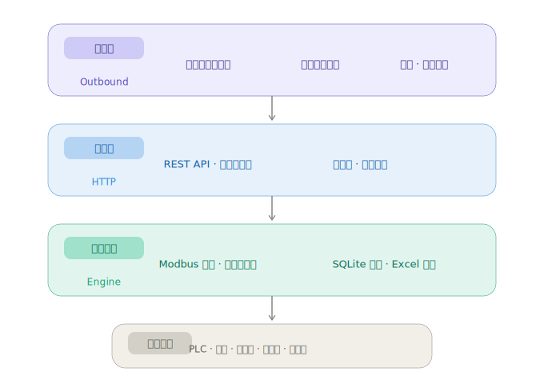

# one-modbus

生产级 Modbus RTU 数据采集网关，运行于 Windows。一个 .exe 搞定工业数据采集全链路：多串口 Modbus 并发采集 → REST API → SQLite 历史存储 → 微信/邮件报警。

传统工业数据采集需要三个独立系统：数据采集器、网页展示平台、报警报表定制开发。
**这一个 .exe 替代了这三层的全部功能。**

---

## 功能特点

| 模块 | 功能 |
|------|------|
| **Modbus 采集引擎** | 多串口、多设备、多变量并发采集，每个串口独立 goroutine |
| **批量读优化** | 同一设备的多变量打包为一个 Modbus 请求，极大提升采集效率 |
| **零代码配置** | 填写 Excel 表格，双击 .exe，完事 |
| **内置 HTTP API** | REST 接口，前端或 SCADA 系统直接调用获取数据 |
| **SQLite 时序存储** | 自动历史数据记录，支持网页端曲线图查询 |
| **企业微信报警** | 设备异常自动推送企业微信群机器人 |
| **邮件推送** | 定时报表 + 即时报警邮件 |
| **远程升级** | 浏览器上传新 .exe，自动替换并重启 |

## 远程采集架构（互联网 + DTU）

**不仅仅是本地串口采集**。配合 ¥99 的 DTU（串口转 TCP 硬件）和虚拟串口软件，可以从任意地点的设备采集数据：

```
现场 A：254 台电表 → RS-485 → DTU(¥99) → 互联网 →
现场 B：PLC 设备   → RS-485 → DTU(¥99) → 互联网 →  虚拟串口软件  →  one-modbus 网关
现场 C：传感器     → RS-485 → DTU(¥99) → 互联网 →  (TCP转COM桥)     (实时轮询采集)
```

- 1 个 DTU + 1 根 RS-485 总线 = 每个现场最多 **254 台设备**（Modbus 地址限制）
- 1 台服务器最多支持 **254 个虚拟串口**
- 理论极限：**一台服务器采集 64,516 台设备**
- **每台设备硬件成本不到 ¥0.40**

软件不看 COM 口是本地还是 100 公里外——它只管通过 COM 口拉 Modbus 数据。

## 快速开始

1. 在 .exe 同级目录下准备 `项目变量信息.xlsx`（项目变量配置表）。**如果文件不存在，软件自动生成模板**——桌面也有快捷键可一键生成
2. 双击 `modbusrtu_broker.exe`
3. 浏览器打开 **`http://127.0.0.1:53046/统计`** ——这是一切的入口。还没登录的话，它会引导你去登录
4. 输入用户名和密码登录——**用户名密码在 Excel 表格中设定**，非硬编码
5. 登录后页面直接展示所有可用 API 的实际调用链接、示例请求、实时值和网关状态。**所有的东西都在这里**

详细说明见 `docs/quick-start.md`。

## 兼容性

- **操作系统**: Windows (7/10/11/Server) — 需要 COM 口访问权限
- **协议**: Modbus RTU (RS-232/RS-485)，功能码 1/2/3/4
- **设备**: PLC、智能电表、传感器、变频器、温控器 — 任何支持 Modbus RTU 协议的设备

## 系统架构



## 开源协议

GNU Affero General Public License v3.0 (AGPL-3.0)

任何公司修改本软件后，以网络服务形式提供给第三方使用，**必须**公开发布修改后的完整源码。详见 `LICENSE` 文件。
